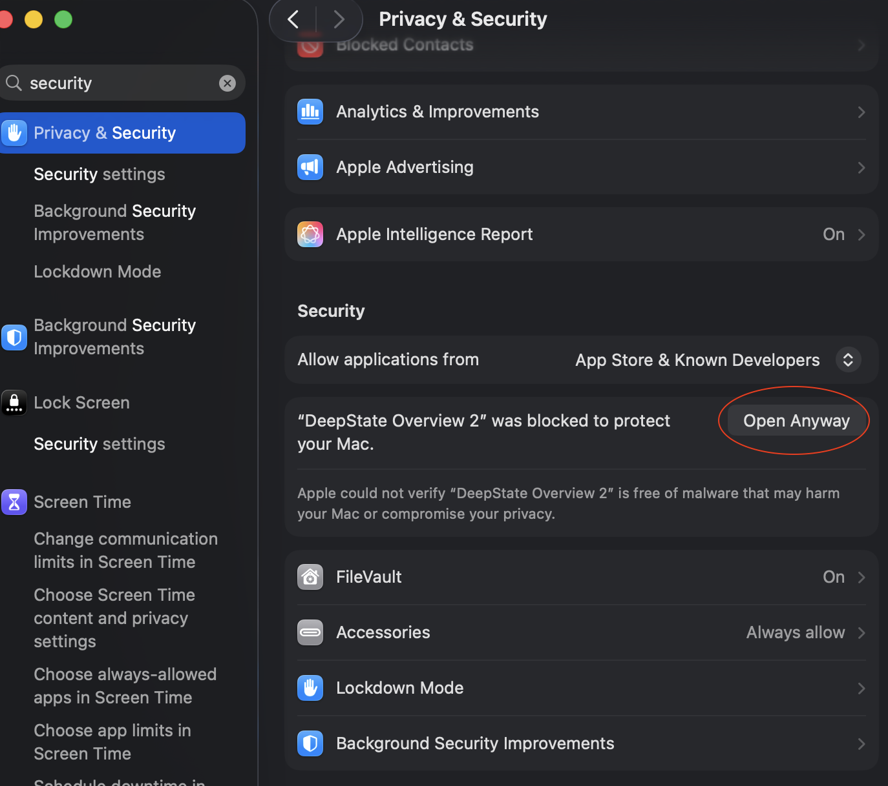

# sii-deepstate

Headless screenshots of the [DeepState Map](https://deepstatemap.live) for
Ukrainian locations, with support for multi-location overview images that
include automatic label placement and leader lines.


## Features

- **Single-location mode** — screenshot one city or coordinate pair at a
  chosen zoom level.
- **Overview mode** — screenshot several locations on one map, automatically
  fit the viewport to the bounding box, and place city labels using a greedy
  8-slot algorithm with leader lines so they never overlap.
- Geocoding via [Nominatim](https://nominatim.org/) — pass place names, not
  coordinates.
- Hides site chrome (sidebar, controls, overlays) and clutter layers
  (NATO markers, units, HQs, airfields, railways) for a clean map.
- Optional satellite basemap.

## Quick start (no command line)

A macOS app is published with every release. It exposes overview mode through
a small Tkinter window — type one location per line, hit **Generate Overview**,
and the resulting PNG opens in Preview.

1. Go to the [Releases page](https://github.com/bengtlofgren/sii-deepstate/releases)
   and download the latest `DeepState-Overview-*-arm64.zip`.
2. Unzip and drag **DeepState Overview.app** to `Applications`.
3. **First launch only — approve the unsigned app in System Settings.**
   See [Approving the app on first launch](#approving-the-app-on-first-launch)
   below.
4. On the very first run the app downloads the browser engine (~80MB).
   After that it's instant.

Output PNGs are saved to `~/Pictures/DeepState Overviews/`.

> Apple Silicon (M1/M2/M3/M4) only. Intel Mac builds aren't published.

### Approving the app on first launch

The bundle is unsigned and unnotarized, so on first launch macOS Gatekeeper
will block it with a "cannot be opened" dialog. This is **not** a bug or a
sign of malware — it's the default policy for any app whose developer hasn't
paid Apple's $99/year Apple Developer Program fee for a signing certificate.
I haven't, so you'll need to grant permission once. After that, macOS
remembers and the app launches normally.

Steps (macOS Sonoma 14+ / Sequoia 15+):

1. Double-click **DeepState Overview.app**. You'll see a dialog saying it
   can't be opened because Apple cannot verify it. Click **Done** (do *not*
   click "Move to Trash").
2. Open **System Settings → Privacy & Security**.
3. Scroll down to the **Security** section. You'll see a message:
   *"DeepState Overview.app was blocked to protect your Mac."* Click
   **Open Anyway** next to it.
4. Authenticate with Touch ID or your password when prompted.
5. A final confirmation dialog appears — click **Open Anyway** again.



You only do this once per install. Subsequent launches go straight through.

## Run with Docker

The headless CLI is published as a container image to GHCR.

```bash
docker run --rm -v "$PWD/screenshots:/out" \
    ghcr.io/bengtlofgren/sii-deepstate:latest \
    --overview "Sumy" "Vovchansk" "Kupiansk" "Kramatorsk"
```

Any flag that the Python CLI accepts can be passed after the image name. Output
PNGs land in `./screenshots` on your host.

## Setup (from source)

Requires Python 3.11+.

```bash
python -m venv .venv
source .venv/bin/activate
pip install -r requirements.txt
playwright install chromium
```

## Usage

### Single location

```bash
python deepstate_screenshot.py "Vovchansk" --zoom 12
python deepstate_screenshot.py 50.3969 36.8784 --zoom 11
```

### Overview of multiple locations

```bash
python deepstate_screenshot.py --overview \
    "Sumy" "Vovchansk" "Kupiansk" "Kramatorsk" \
    "Kostiantynivka" "Pokrovsk" "Huliaipole" "Orikhiv"
```

Output PNGs are written to `screenshots/`.

### Useful flags

| Flag            | Effect                                                    |
| --------------- | --------------------------------------------------------- |
| `--zoom N`      | Zoom level for single-location mode (default 13)          |
| `--overview`    | Treat positional args as a list of locations to plot      |
| `--satellite`   | Use the satellite basemap                                 |
| `--map-only`    | Hide all UI chrome (applied automatically in overview)    |
| `--show-ifs`    | Enable the IFS layer                                      |

### Build the macOS app locally

If you want to produce the `.app` bundle on your own machine instead of
downloading the release artifact:

```bash
pip install -r requirements-build.txt
cd app
./build.sh
```

The bundle ends up at `app/dist/DeepState Overview.app`.

## How overview label placement works

1. Geocode every location and fit the Leaflet map to their bounding box with
   fractional zoom (`zoomSnap: 0`) for the tightest possible crop.
2. Drop markers and measure each label's pixel size.
3. For every marker, evaluate 8 candidate slots (N, NE, E, SE, S, SW, W, NW)
   at escalating radii. Each candidate is scored against already-placed
   labels, other markers, and the viewport edges.
4. Place labels north-to-south so upper cities get first pick of N slots.
5. Draw a thin leader line from any label more than ~32px from its anchor.

## Layout

```
deepstate_screenshot.py              # main CLI script
app/                                 # Tkinter GUI + macOS .app build
Dockerfile                           # GHCR image (headless CLI)
.github/workflows/release.yml        # CI: builds the .app + Docker image
.claude/skills/deepstate-screenshot/ # Claude Code skill wrapper
assets/example_screenshots/          # example output
requirements.txt                     # runtime deps
requirements-build.txt               # PyInstaller (only needed to build .app)
```
