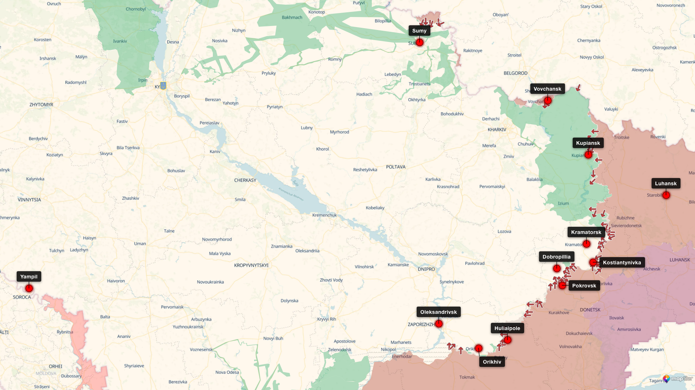

# sii-deepstate

Headless screenshots of the [DeepState Map](https://deepstatemap.live) for
Ukrainian locations, with support for multi-location overview images that
include automatic label placement and leader lines.



## Features

- **Single-location mode** — screenshot one city or coordinate pair at a
  chosen zoom level.
- **Overview mode** — screenshot several locations on one map, automatically
  fit the viewport to the bounding box, and place city labels using a greedy
  8-slot algorithm with leader lines so they never overlap.
- Geocoding via [Nominatim](https://nominatim.org/) — pass place names, not
  coordinates.
- Hides site chrome (sidebar, controls, overlays) and clutter layers
  (NATO markers, units, HQs, airfields, railways) for a clean map.
- Optional satellite basemap.

## Setup

Requires Python 3.11+.

```bash
python -m venv .venv
source .venv/bin/activate
pip install -r requirements.txt
playwright install chromium
```

## Usage

### Single location

```bash
python deepstate_screenshot.py "Vovchansk" --zoom 12
python deepstate_screenshot.py 50.3969 36.8784 --zoom 11
```

### Overview of multiple locations

```bash
python deepstate_screenshot.py --overview \
    "Sumy" "Vovchansk" "Kupiansk" "Kramatorsk" \
    "Kostiantynivka" "Pokrovsk" "Huliaipole" "Orikhiv"
```

Output PNGs are written to `screenshots/`.

### Useful flags

| Flag            | Effect                                                    |
| --------------- | --------------------------------------------------------- |
| `--zoom N`      | Zoom level for single-location mode (default 13)          |
| `--overview`    | Treat positional args as a list of locations to plot      |
| `--satellite`   | Use the satellite basemap                                 |
| `--map-only`    | Hide all UI chrome (applied automatically in overview)    |
| `--show-ifs`    | Enable the IFS layer                                      |

## How overview label placement works

1. Geocode every location and fit the Leaflet map to their bounding box with
   fractional zoom (`zoomSnap: 0`) for the tightest possible crop.
2. Drop markers and measure each label's pixel size.
3. For every marker, evaluate 8 candidate slots (N, NE, E, SE, S, SW, W, NW)
   at escalating radii. Each candidate is scored against already-placed
   labels, other markers, and the viewport edges.
4. Place labels north-to-south so upper cities get first pick of N slots.
5. Draw a thin leader line from any label more than ~32px from its anchor.

## Layout

```
deepstate_screenshot.py              # main script
.claude/skills/deepstate-screenshot/ # Claude Code skill wrapper
assets/example_screenshots/          # example output
requirements.txt
```
